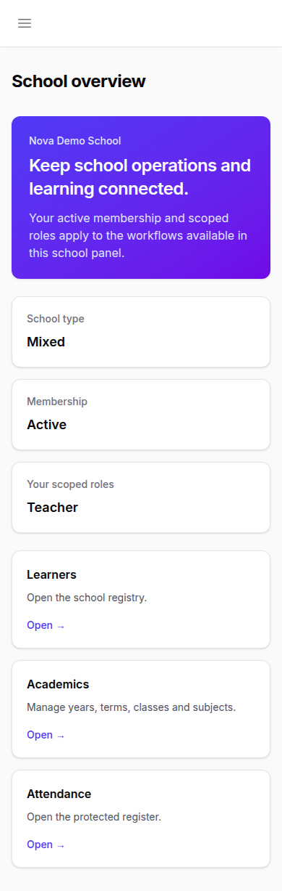
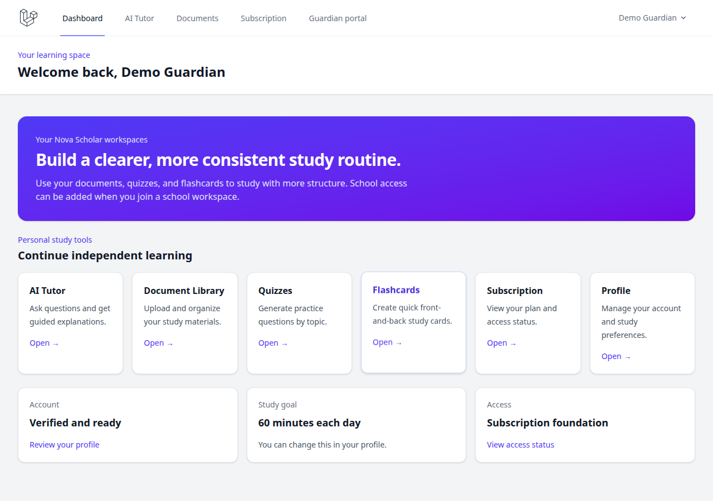
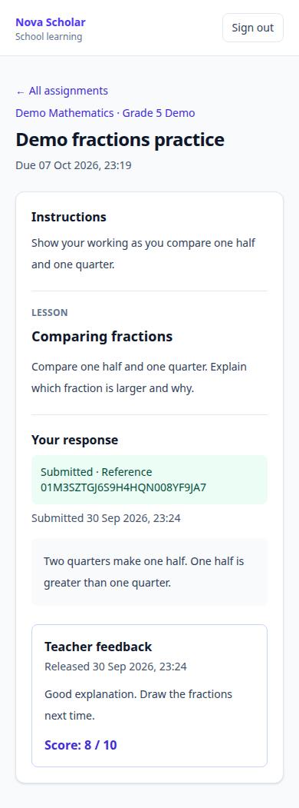

# Case-study pages, screenshots and operation flows

Date: 30 September 2026. Status: study complete; recommendations proposed, application behavior unchanged.

Follow-up, 1 October 2026: the owner approved the [usability implementation plan](plans/school-trial-usability.md). UT-01–05 now implement the entry, task discovery, focused review, safeguard and setup recommendations. Findings below describe the original 30 September snapshot; current outcomes are recorded in the plan/log.

## Main conclusion

Nova Scholar has a working local school learning loop: teacher lesson/assignment → learner draft/final response → teacher private feedback → released learner feedback. Its school administration, attendance, guardian relationships and controlled publishing provide a useful demo foundation. The largest visible trial gaps are **getting each person to the right first page, showing their next task, and preserving their place while working**.

Use App-School-Management for consistent record screens, Skuul for visible school/academic context and navigation continuity, and LAVSMS for parent/result/output journeys. Retain Nova's tenant authorization, managed learner boundaries and explicit publication rules. A broad module list or an attractive dashboard does not establish readiness for a sustained school trial.

## Evidence and limits

Three local clones were inspected at these commits:

| Reference | Snapshot | Installed-stack evidence from manifest | Inspection |
| --- | --- | --- | --- |
| [App-School-Management](https://github.com/muhamadfikrii/App-School-Management/tree/99b8001ea0ea3943b3bb52dc6f09cffbcd965040) | `99b8001`, 10 December 2025 | Laravel 12 / Filament 4 | Routes, public Blade pages, staff panel, student/grade/report resources |
| [Skuul](https://github.com/yungifez/skuul/tree/8de86bac3f03637f48343c848ac6eea001951f99) | `8de86b`, 20 August 2026 | Laravel 13 / Livewire 4; README's Laravel 9 description is stale | Login/context middleware, current layout/menu, student forms, exam records, result checker |
| [LAVSMS](https://github.com/4jean/lav_sms/tree/10a2e962686da88bd7bc20135c75032367cc0750) | `10a2e96`, 20 September 2022 | Laravel 8; older Bootstrap/jQuery screens | Login/dashboard, role menus, class/student creation, marks and parent pages |

**Source-observed** means a path/control/action exists in the checkout; it does not prove the deployed screen or operation works. **Publisher screenshot** means a README-linked image was retrieved and visually inspected; it may show an older version. **Nova browser-verified** means a specific journey was exercised locally using a fresh, isolated SQLite database and synthetic accounts. **Proposed** means future work.

No reference application, dependency installer, migration or test was executed. No source was copied and no dependencies changed. App-School-Management's checkout has no license text despite its MIT metadata; the other two contain MIT licenses. Their code is not a drop-in match for Nova's authorization or Kenyan school reporting rules.

Nova evidence covers Chromium at 390px and 1280px, 16 screenshots and selected operations. It is not a whole-product accessibility audit, user study, production readiness test, or performance benchmark. No measured human task times or comparative click counts are claimed. Earlier automated test evidence remains in the [implementation log](implementation-log.md); those suites were not rerun for this documentation study.

## Comparison at a glance

| Journey | App-School-Management | Skuul | LAVSMS | Current Nova |
| --- | --- | --- | --- | --- |
| Public arrival | Public website for one named school: programmes, news, staff, activities | Root leads to protected dashboard/login | Application login is the practical entry | Public product landing with several workspace choices |
| First staff destination | Filament dashboard; school resource groups | Dashboard with school and academic context | Dashboard counts/calendar with broad role menus | Filament school overview; school identity and role/status cards |
| Small record task | Students list → create/edit form → saved record | Students → create account/student fields → save | Classes → create tab → save, with automatic-section explanation | Academics → add subject → success and updated list; locally exercised |
| Teacher task | Grade entry and final-grade/report forms | Select exam/class/subject/section → per-student score save | Select exam/class/section/subject → marks → totals/results | Attendance plus lessons, assignments, submissions and released feedback |
| Parent/learner | No separate guardian/learner workspace demonstrated in inspected panel | Own/linked-child published results through result checker | My Children → child profile or marksheet → year → print | Separate learner and linked-child portals; guardian login currently detours through personal study |
| Best lesson | Consistent resource list/form/action conventions | Keep school/term and filter context visible | Make the final output and child-related routes explicit | Preserve controlled publication and school/child scope while improving task discovery |

## 1. App-School-Management: public school site into staff records

### Page flow

Source-observed public path:

`/ → school introduction → programmes/news/staff/activity pages → Login Admin → /admin → staff dashboard`

This landing page advertises a particular school. It is useful for a school's own public website, but it does not demonstrate onboarding schools into a multi-school product. The public label “Login Admin” also understates that the panel permits teachers.

Small operation:

`Students resource → searchable/filterable list → Create → identity/class/contact fields → save → list → select row → edit → save changes`

The student form groups related fields and uses searchable class options. The table has class/status filtering and pagination. Row selection opens editing rather than a separate read-only profile; Nova should keep its explicit learner-detail and lifecycle controls for consequential actions.

Teacher assessment path:

`Grades → choose year/semester/class → learner/subject/teacher/component → enter score → save → reports/final grade → learner/year/semester → component results → PDF export`

Dependent fields and resource conventions make the next action predictable. The report structure is an inspiration, not an accepted assessment policy: calculations/publication need Nova-specific validation and a school-approved template.

No separate parent or managed-learner journey was demonstrated by the inspected routes/panel access. That is a limitation of the inspected evidence, not proof that no upstream extension could provide one.

### Visual evidence and caveats

No published UI screenshot was found in the inspected README. `public/img/` contains website imagery, including a hero image; these are assets, not screen captures. Public source shows a prominent exploration button without a destination/action; that potential dead end was not runtime-tested.

Source anchors: [routes](../casestudies-examples/app-school-management/routes/web.php), [public home](../casestudies-examples/app-school-management/resources/views/livewire/Page/home.blade.php), [public navigation](../casestudies-examples/app-school-management/resources/views/livewire/partials/navbar.blade.php), [student resource](../casestudies-examples/app-school-management/app/Filament/Resources/Students/StudentsResource.php), [student form](../casestudies-examples/app-school-management/app/Filament/Resources/Students/Schemas/StudentsForm.php), [grade form](../casestudies-examples/app-school-management/app/Filament/Resources/Grades/Schemas/GradeForm.php).

## 2. Skuul: school context and a continuous task path

### Page flow

Source-observed entry:

`/ → dashboard/login → authenticated, verified, active account → authorized working school → academic year/semester context → permission-filtered sidebar → task`

Public self-registration is not the normal route; invitations/provisioning establish accounts. The dashboard provides school/academic setup controls, metrics and notices. Some work depends on an active academic year and semester. This helps prevent context mistakes, but a novice needs an explanation and direct setup link when a prerequisite blocks a task.

Small operation:

`Students → Create → reusable account fields + student record fields → submit → authorization/service → success message → student list/detail`

Assessment operation:

`Exam records → exam/class/subject/section selectors → View records → paginated learner rows → enter component marks → save a learner's row → return to that learner's anchor`

The exam-record Livewire component declares query-string state for selected exam/subject/section and search. This is a concrete continuity pattern Nova can adapt: a refresh/bookmark should restore the authorized task context.

Parent/student results:

`Result checker → own learner or linked child → academic year/semester → Check result → published results`

The component selects an appropriate learner context for students and parents and offers class selection to authorized staff. Do not equate a published-results flag with Nova's intended immutable moderated report versions.

### Visual evidence and caveats

The [README dashboard screenshot](https://user-images.githubusercontent.com/63137056/216740379-18cb9f1d-5e80-4bc8-8b99-07d08ea98da4.png) was retrieved and inspected. It shows a dark sidebar, school identity and a prominent working-school selector. The current clone uses an April UI sidebar layout, so this older image cannot verify the current appearance or mobile behavior.

Source anchors: [routes](../casestudies-examples/skuul/routes/web.php), [current layout](../casestudies-examples/skuul/resources/views/layouts/app.blade.php), [menu definitions](../casestudies-examples/skuul/app/Livewire/Layouts/Menu.php), [student form](../casestudies-examples/skuul/resources/views/livewire/create-student-form.blade.php), [exam-record state](../casestudies-examples/skuul/app/Livewire/ListExamRecordsTable.php), [exam-record view](../casestudies-examples/skuul/resources/views/livewire/list-exam-records-table.blade.php), [result checker](../casestudies-examples/skuul/app/Livewire/ResultChecker.php).

## 3. LAVSMS: explicit school outputs and parent paths

### Page flow

Source-observed entry:

`Login with email/login ID → /home → dashboard → role-aware sidebar → Academics / Administration / Students / Exams`

The shell offers a large inventory of operational pages. The publisher dashboard screenshot gives significant space to counts and an event calendar; it does not demonstrate prioritized teacher work or mobile usability.

Small operation:

`Manage Classes → Create New Class tab → class name/type → submit → class saved and default section created → Manage Sections`

The form explicitly explains the automatic section and links to the next setup task. This is a useful model for Nova's setup dependencies: explain the resulting state rather than only displaying “saved.”

Teacher results:

`Exams/Marks → exam/class/section/subject → class roster → record marks → update computed grades/totals/positions → marksheet/year selection → printed result`

The endpoint produces a tangible school output. Its mutable grading/calculation implementation and school-wide repositories must not replace Nova's scoped services or supply unapproved Kenyan grading rules.

Parent path:

`My Children → selected child row → View Profile or Marksheet → school year → result → print`

This is a clearer family destination than leading a guardian through unrelated study tools. Some child actions are hidden in overflow menus, so the most common parent action could still be more visible.

### Visual evidence and caveats

Retrieved and inspected README images: [login](https://i.ibb.co/Rh1Bfwk/login.png), [dashboard](https://i.ibb.co/D4T0z6T/dashboard.png), [marksheet](https://i.ibb.co/GCgv5ZR/marksheet.png). They show a centered login card, a dense operational sidebar/dashboard, and a marksheet with component scores, totals, remarks and a print action. These are historical publisher examples, not runtime verification of the pinned checkout. Images containing example individual information are linked rather than copied into Nova's documentation assets.

Source anchors: [menu](../casestudies-examples/lav_sms/resources/views/partials/menu.blade.php), [class page](../casestudies-examples/lav_sms/resources/views/pages/support_team/classes/index.blade.php), [class controller](../casestudies-examples/lav_sms/app/Http/Controllers/SupportTeam/MyClassController.php), [marks controller](../casestudies-examples/lav_sms/app/Http/Controllers/SupportTeam/MarkController.php), [parent children page](../casestudies-examples/lav_sms/resources/views/pages/parent/children.blade.php).

## 4. Nova: what the current journey actually does

### Public entry and setup

Browser-verified: the landing CTA “Build your school workspace” opens ordinary registration. Source inspection shows registration creates a personal-study `Student` account, not a school or staff membership. Platform provisioning/invitations exist separately. The CTA therefore promises a different outcome from its destination.

Browser-verified staff path:

`School sign-in → school overview → Academics → subject name/code → Add subject → named success message and subject listed`

The subject operation succeeded in the isolated database. Academic setup currently presents multiple forms on one page; a first-use sequence would make the year/term/class/teacher dependencies easier to understand.

### Teacher, learner and guardian operations

Browser-verified attendance:

`Teacher sign-in → school overview → Attendance → teaching assignment/date → Open register → mark learner present → Save register → success → guardian linked-child attendance`

The register's wide table scrolls within its container on mobile, without document-wide overflow. This is different from the landing overflow issue below.

Browser-verified learning loop:

`Learner sign-in → learner home → assignments → open assignment → write response → Save draft → Submit final response → durable submission state`

`Teacher → Learning → select course → assignment → Review submissions → Open response → feedback and optional score → Save feedback draft → Release feedback`

`Learner reopens assignment → released feedback and score displayed`

The study exercised an 8/10 score. The learner capture shows the final response, acknowledgement, release time and feedback. Explicit private draft versus released feedback is a strength. Earlier automated acceptance covers wider authorization/concurrency boundaries; this browser study does not replace that evidence.

Browser-verified guardian entry:

`Adult sign-in → personal-study dashboard → Guardian portal → linked children/attendance`

The first page says “Your learning space” and promotes AI Tutor, documents, flashcards and subscription. A guardian can reach the correct portal, but the detour obscures the school trial's purpose.

### Current implementation versus remaining work

Current code and recorded verification include school roles/provisioning, learner/guardian registry, academic setup, attendance/corrections, in-app notices, school fee operations, teacher-authored lessons/resources, text assignments/submissions and teacher released feedback. Only selected operations above were exercised in this study.

Formal school report templates, moderated report publication/amendments, extensions/resubmissions, response attachments and external notice delivery are not established as complete. A reviewed printable report is the clearest output gap relative to the references, but requires an agreed school template and grading policy. Hosted operation, recovery and actual school onboarding remain open. New commercial finance work is outside the owner's trial priority; existing school fee functionality can remain optional.

## 5. Findings for Nova, with source locations

| Priority | Location | Finding and evidence |
| --- | --- | --- |
| High | `resources/views/landing.blade.php:35`; `app/Http/Controllers/Auth/RegisteredUserController.php:50` | School-building CTA leads to personal account registration. Destination verified in browser; account behavior traced in source. Use an honest trial/provisioning path or clearly identify personal registration. |
| High | `resources/views/landing.blade.php:21`; `routes/web.php:64` | Signed-in managed learner's Open workspace targets adult-only dashboard. Browser request returned **403**. Resolve role-appropriate workspace before navigation. |
| High | `routes/web.php:39`; `resources/views/dashboard.blade.php:1` | Guardian falls through to personal-study home. Browser verified. Give linked guardians a child-oriented default; account combinations need an explicit switcher. |
| High | `app/Filament/School/Pages/SchoolOverview.php:85`; `resources/views/filament/school/pages/school-overview.blade.php:12` | Overview emphasizes school type/membership/roles. Its workflow cards omit Learning, although the sidebar has it. Add authorized teaching actions and meaningful pending-work counts. |
| Medium | `app/Filament/School/Pages/SchoolLearning.php:63`; `app/Filament/School/Pages/SchoolLearning.php:97` | Course/review selection has no URL state. Refresh removed the selected review in the browser. Preserve scoped selections and back-navigation context. |
| Medium | `resources/views/filament/school/pages/school-learning.blade.php:1` | Course setup, lesson authoring, assignment publishing and marking share one long page. Selected mobile review capture was **3,071px** high with five forms. Separate task views or collapse inactive authoring sections. Height is an observation, not a measured usability failure. |
| Medium | `resources/views/learner/assignments/index.blade.php:35` | List displays Submitted/Draft saved without a released-feedback-ready indicator. Source-observed. Make new feedback discoverable without reopening every assignment. |
| Medium | `resources/views/landing.blade.php:45` | At 390px the document overflows horizontally; an empty decorative element extends to x=402. Source has an absolutely positioned negative-inset glow. Constrain decoration and verify narrow viewports. |
| Medium | `resources/views/filament/school/pages/attendance-register.blade.php:59` | Per-learner status select lacks a programmatic learner-specific label. Column heading is not an associated control label. Correction-reason input already has an aria-label; preserve it. |
| Medium | `resources/views/learner/assignments/show.blade.php:80` | Final submission is immutable, but the form has no confirmation/unsaved-navigation guard. Source-observed. Explain finality clearly and protect unfinished drafts. Do not claim browser data-loss testing was performed. |
| Low | `resources/views/landing.blade.php:108`; `resources/views/filament/school/pages/school-overview.blade.php:9` | Deferred-AI and membership-scope wording exposes implementation concepts. Replace with school-user language and visible next actions. |

Accessibility findings use the [Web Interface Guidelines](https://github.com/vercel-labs/web-interface-guidelines/blob/main/command.md) as a checklist, alongside direct source inspection. Keyboard, screen-reader, contrast and reduced-motion compliance across the entire application are not certified by this study.

## 6. Recommended sequence for the school demo

1. **Fix entry destinations and landing fit.** Honest school-trial CTA, guardian entry, role-aware Open workspace and no document overflow at 390px. Acceptance: each demo role reaches its authorized home; ordinary registration never implies a school was created.
2. **Make the home page a daily task page.** Teacher: take attendance, open courses, review submitted work. Learner: pending assignments and released feedback. Guardian: children, recent attendance and notices. Keep school identity visible and query every count through existing authorization.
3. **Preserve and shorten the teaching journey.** Course/assignment/response URLs or authorized query state, focused marking view, clear return links and draft/final safeguards. Acceptance: refresh/back preserves the selected task without leaking another school's records; released content stays immutable.
4. **Guide first school setup.** A checklist with links: year/term → class/subject → staff assignment → learners/guardian links → first lesson/assignment. Explain dependencies and completion outcomes, as LAVSMS does for class/section setup. Reuse existing services rather than building duplicate forms.
5. **Validate the trial with school people, then choose the next output.** Demonstrate admin setup, one teacher, learners and a guardian. Record completion, confusion and actual repeated use. Agree a sample school report before implementing report calculations/publication. Resolve hosting, account delivery and recovery before sustained real-data use. Defer commercial pricing discussion as requested.

All five are proposed follow-up work. This study changes documentation and captures only; it does not implement these recommendations.

## 7. Nova screenshot evidence

All local images below contain synthetic demo information and were captured on 30 September 2026. No credentials or real school records are included. Reference publisher images remain external links in their respective sections.

| Screen | Capture |
| --- | --- |
| Public landing | [Desktop, 1280px](assets/case-study-page-flow/nova-landing-desktop.png) · [Mobile, 390px](assets/case-study-page-flow/nova-landing-mobile.png) |
| CTA destination | [Personal registration](assets/case-study-page-flow/nova-registration.png) |
| Staff entry | [School sign-in](assets/case-study-page-flow/nova-staff-login.png) |
| Administrator | [Overview](assets/case-study-page-flow/nova-admin-home.png) · [Subject creation outcome](assets/case-study-page-flow/nova-subject-created.png) |
| Teacher | [Mobile overview](assets/case-study-page-flow/nova-teacher-home-mobile.png) · [Mobile attendance](assets/case-study-page-flow/nova-attendance-mobile.png) |
| Guardian | [Actual first dashboard](assets/case-study-page-flow/nova-guardian-dashboard.png) · [Linked children portal](assets/case-study-page-flow/nova-guardian-children.png) |
| Learner | [Mobile home](assets/case-study-page-flow/nova-learner-home-mobile.png) · [Assignment list](assets/case-study-page-flow/nova-learner-assignments-mobile.png) · [Saved response draft](assets/case-study-page-flow/nova-learner-draft-mobile.png) |
| Teacher review | [Mobile private draft](assets/case-study-page-flow/nova-teacher-review-mobile.png) · [Desktop private draft](assets/case-study-page-flow/nova-teacher-review-desktop.png) |
| Final learner outcome | [Released feedback, mobile](assets/case-study-page-flow/nova-learner-feedback-mobile.png) |

### Teacher's current first page

### Guardian's current first page

### Completed learner outcome

